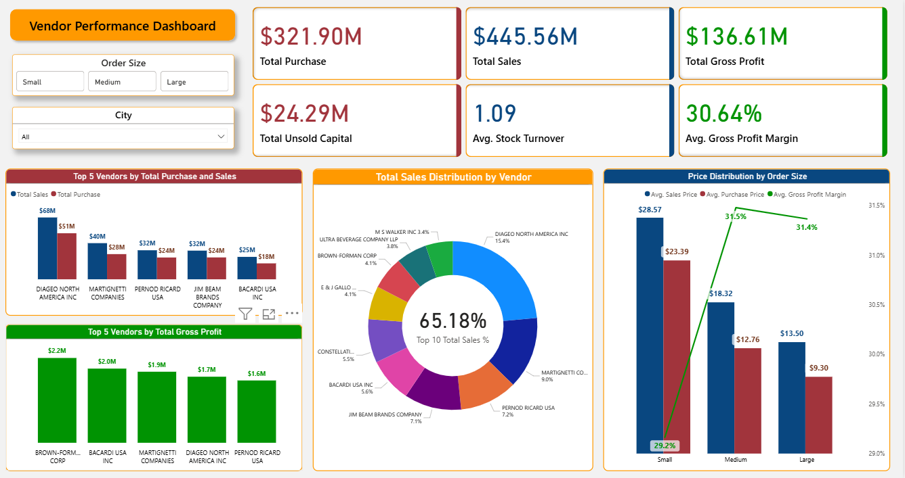

# 📦 Vendor Performance Analysis (SQL + Python + Power BI)

## 🧭 Overview

This project analyzes vendor-level performance using purchase and sales data across stores, leveraging SQL for data preparation, Python for cleaning and analysis, and Power BI for building interactive dashboards.

---

## 📸 Final Dashboards

### Main Dashboard



---

### All Pages Grid View

*(Insert image)*
``

---

## 📂 Project Structure

```
├── data/
│   ├── begin_inventory.csv
│   ├── end_inventory.csv
│   ├── purchases.csv
│   ├── purchase_prices.csv
│   ├── sales.csv
│   ├── vendor_invoice.csv
│
├── inventory.db
├── ingestion_db.py
├── get_vendor_summary.py
├── vendor_sales_summary.ipynb
├── vendor_sales_summary.pbix
└── README.md
```

---

## ⚙️ Step-by-Step Workflow

### 1. Data Ingestion (🔧 `ingestion_db.py`)

* Loaded all raw `.csv` files into a SQLite database `inventory.db`.
* Each file was ingested as a separate table using SQLAlchemy.

### 2. Data Summary & Cleaning (📜 `get_vendor_summary.py`)

* Merged all relevant tables using SQL queries.
* Calculated key metrics like total sales, purchases, freight cost, excise tax, and more.
* Cleaned and enriched the data by:

  * Filling nulls, standardizing strings
  * Calculating `Gross Profit`, `Gross Profit Margin`, `Stock Turnover`, `Sales to Purchase Ratio`

### 3. Exploratory & Performance Analysis (📊 `vendor_sales_summary.ipynb`)

* Conducted summary statistics, visualized KPIs, identified high and low-performing vendors.
* Created insights on:

  * Sales trends by order size
  * Vendor performance ranking
  * Gross profit contribution
  * City- and brand-level profitability

---

### 4. Dashboarding in Power BI (📈 `vendor_sales_dashboard.pbix`)

Before building the dashboard, the following steps were performed:

* ✅ **Imported** the final cleaned data from `vendor_sales_summary.csv` into Power BI.
* ✅ **Created three new summary tables** using DAX `SUMMARIZE` for:

  * **Vendors**: aggregated gross profit by `VendorName`
  * **Brands**: aggregated gross profit by `Description` (brand name)
  * **Cities**: aggregated gross profit by `City`
* ✅ **Calculated measures** using DAX for:

  * **Gross Profit Contribution %** for each vendor, brand, and city
  * **Cumulative Gross Profit %** for Pareto analysis

---

#### 📊 Visualization Structure

##### **Main Page: Overall KPIs**

* Displays core performance metrics:

  * **Total Purchases**
  * **Total Sales**
  * **Total Gross Profit**
  * **Unsold Capital**
  * **Average Stock Turnover**
  * **Average Gross Profit Margin**
* **Slicers used**: `Order Size`, `City`

---

##### **Vendor Page**

* Top 10 Vendors by:

  * Gross Profit
  * Stock Turnover
  * Gross Profit Margin
* A **donut chart** with cumulative gross profit % (Pareto style)
* Slicers: `Order Size`, `City`

---

##### **Brand Page**

* Top 10 Brands with similar KPIs
* Profitability distribution visuals
* Slicers: `Order Size`, `City`, `Vendor Name`

---

##### **City Page**

* City-wise analysis of:

  * Total Sales
  * Total Purchases
  * Gross Profit
  * Stock Turnover
* Highlights top-performing cities by profitability

---

##### **Top 5 Summary Page**

* Shows **Top 5 Vendors**, **Brands**, and **Cities** side by side
* Based on:

  * Total Purchases
  * Total Sales
  * Average Stock Turnover
  * Total Gross Profit
* Final **ranking measure** created using average rank across all four KPIs
* Dynamic filtering enabled using consistent slicers across pages

---

## 🚀 Tech Stack

* **SQL** (SQLite)
* **Python** (pandas, sqlite3, SQLAlchemy)
* **Power BI** (DAX functions, Visualization & Dashboarding)

---

## 📌 Key Insights

* Identified vendors and brands with high gross margins but low sales
* Highlighted top cities with efficient stock turnover
* Built a ranking system to evaluate performance based on 4 major KPIs

